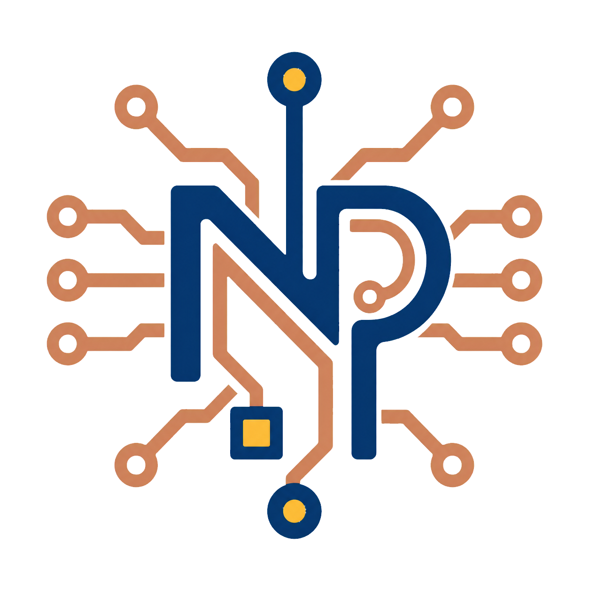
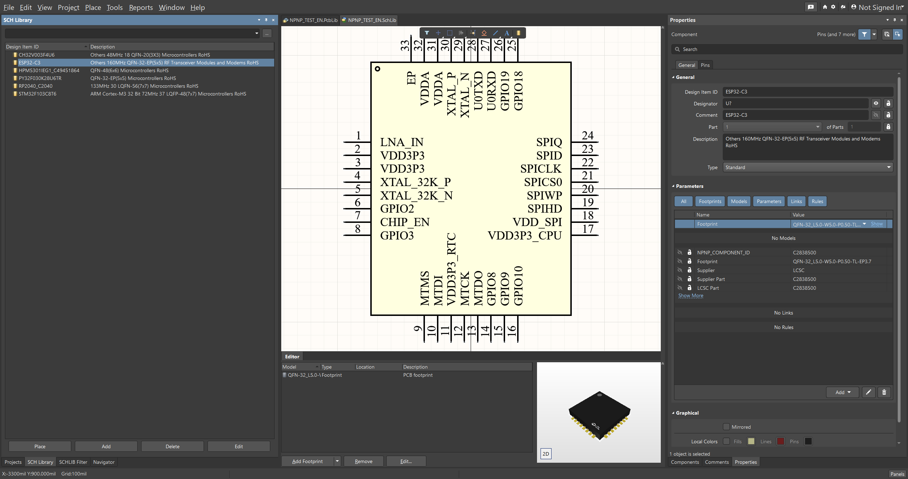
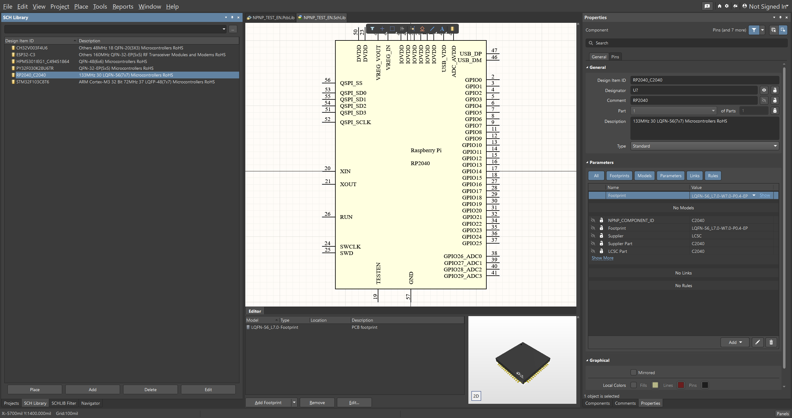
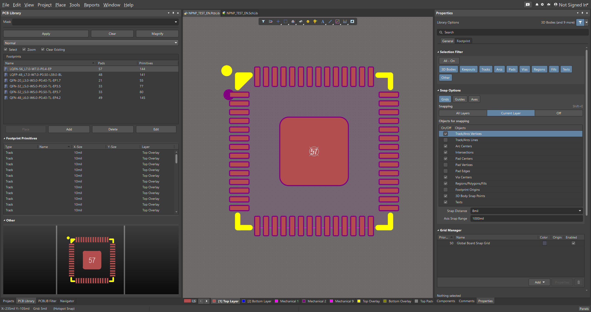
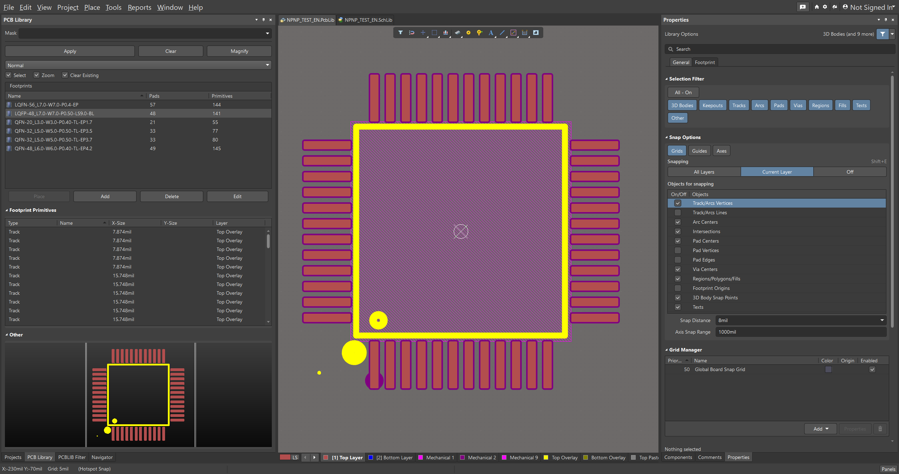
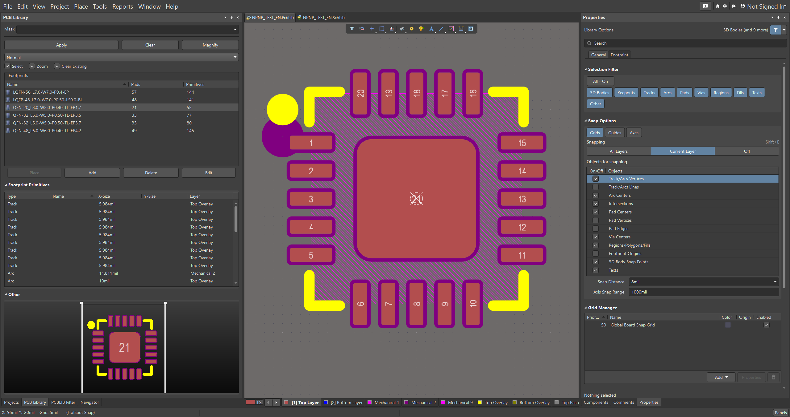
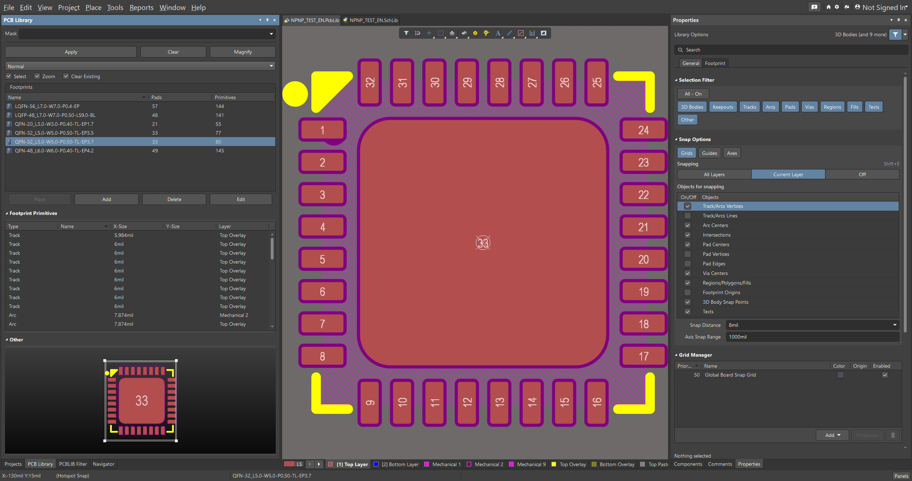
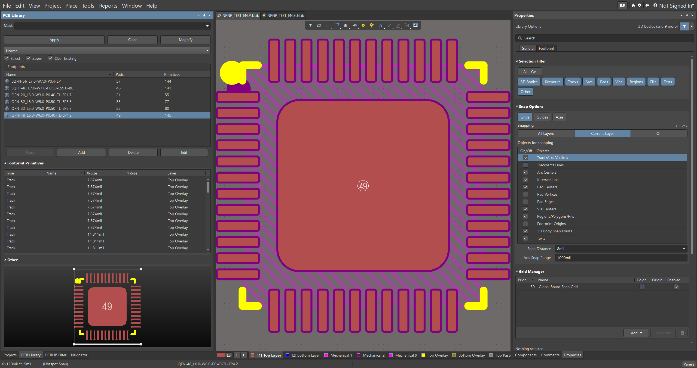
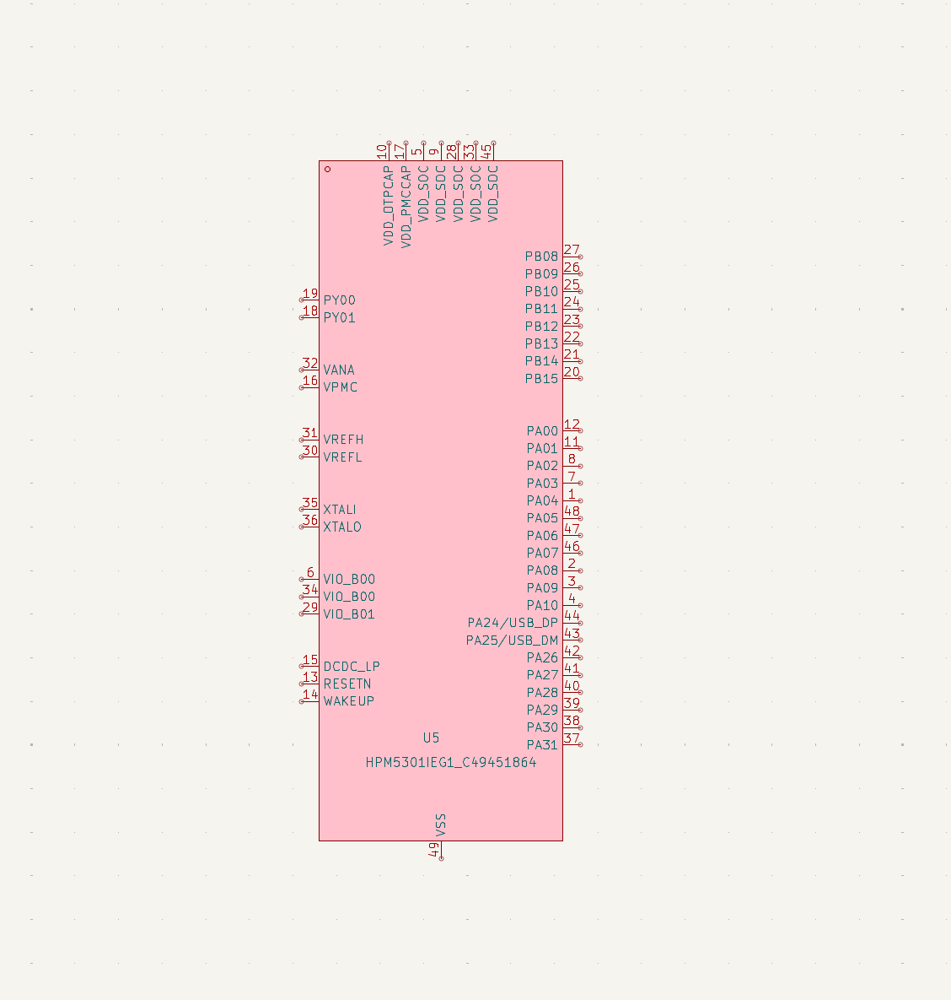
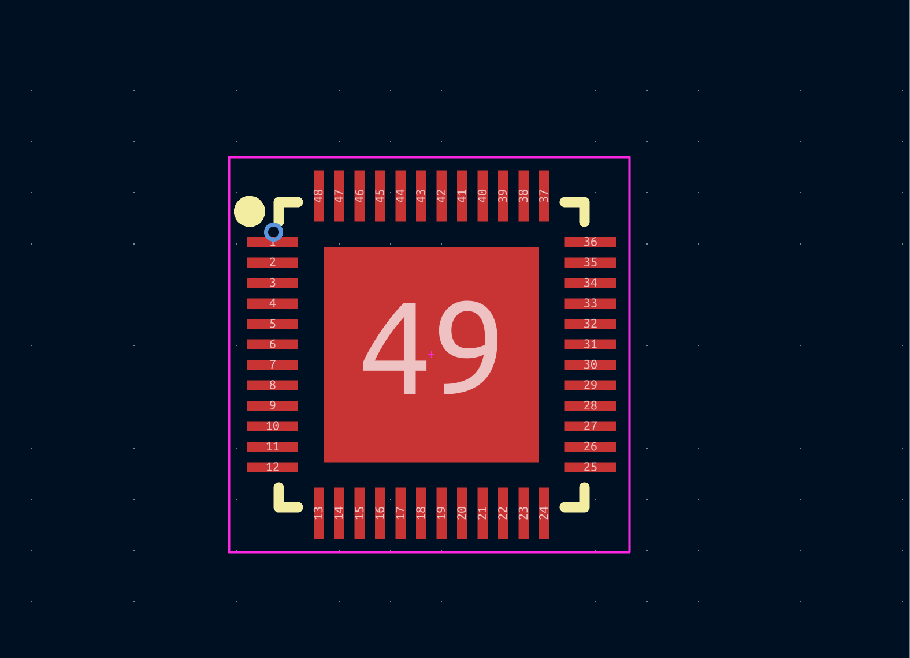

# npnp

<p align="center">
  
</p>

<p align="center">
  <a href=".github/workflows/release.yml"></a>
  <a href="https://www.rust-lang.org/"></a>
</p>

<p align="center">
  <a href="README.md">English</a> | 简体中文
</p>

Normalize Pin Net Pad (`npnp`) 是一个用纯 Rust 编写的 Altium 和 KiCad 器件库导出工具。

`npnp` 可以搜索器件数据，下载上游源文件和 3D 模型，并导出可检查、可使用的原理图库和 PCB 封装库。

## 项目状态

### 已实现

- [x] 按关键字、器件名称或 LCSC 编号搜索器件。
- [x] 下载 STEP 或 OBJ/MTL 格式的 3D 模型。
- [x] 导出原理图符号和 PCB 封装源 JSON，便于检查。
- [x] 导出 Altium 原理图库 (`.SchLib`)。
- [x] 导出 Altium PCB 封装库 (`.PcbLib`)。
- [x] 导出 KiCad 符号库、封装库和 3D 模型库 (`.kicad_sym`, `.pretty`, `.3dshapes`)。
- [x] 在上游提供 STEP 模型时，将 STEP 嵌入 PCB 封装库。
- [x] 从文本文件批量导出多个器件编号。
- [x] 支持单个器件单独导出，也支持合并为库文件对。
- [x] 支持向已有合并库追加新器件，并避免重复添加已有器件编号。
- [x] 支持通过 `--english-metadata` 优先导出英文元数据。

### Roadmap

- [ ] 尽可能移除下载 3D 模型中的 logo/watermark 几何体。
- [ ] 改进不规则焊盘导出 `.PcbLib` 时的阻焊处理。
- [ ] 为更多异常符号和封装增加回归测试样例。
- [ ] 完善批量合并和追加工作流文档。

### 已知限制

- 生成的库文件在用于生产前仍然应该目检确认。
- 部分上游符号和封装可能使用需要特殊处理的图元。

原理图库截图：

<p align="center">
  
  
  
  
  
  
</p>

PCB 封装库截图：

<p align="center">
  
  
  
  
  
  
</p>

KiCad 库预览：

<p align="center">
  
  
  
</p>

## CLI

运行 `npnp --prompt` 可以打印可直接复制的命令。导出命令按目标 EDA 工具分组：

```bash
npnp search C2040 --limit 5

npnp altium export C2040 --full --output altium-libs --force
npnp altium batch --input ids.txt --output generated\altium --merge --library-name MyLib --full --continue-on-error
npnp altium batch --input new_ids.txt --output generated\altium --merge --append --library-name MyLib --full --force --continue-on-error

npnp kicad export C2040 --full --output kicad-libs --library-name MyParts --force
npnp kicad batch --input ids.txt --output generated\kicad --library-name MyParts --full --force --parallel 4 --continue-on-error
```

常用统一参数：

- `--full`：导出该 EDA 工具支持的全部库目标。
- `--force`：覆盖已有生成结果。
- `--english-metadata`：优先使用英文元数据；如果缺失，则自动回退到源数据中的元数据。
- `--library-name`：设置 Altium 合并库名称或 KiCad 库基础名称。
- Altium `--merge` 只创建新的合并库，不会覆盖已有同名库；要给已有合并库追加元件，请使用 `--merge --append`。

## 注意

- 该项目从未上传至 `gitee`，将来也不会上传 `gitee`，也从未授权任何人以个人名义上传，如有发现请顺手举报。
